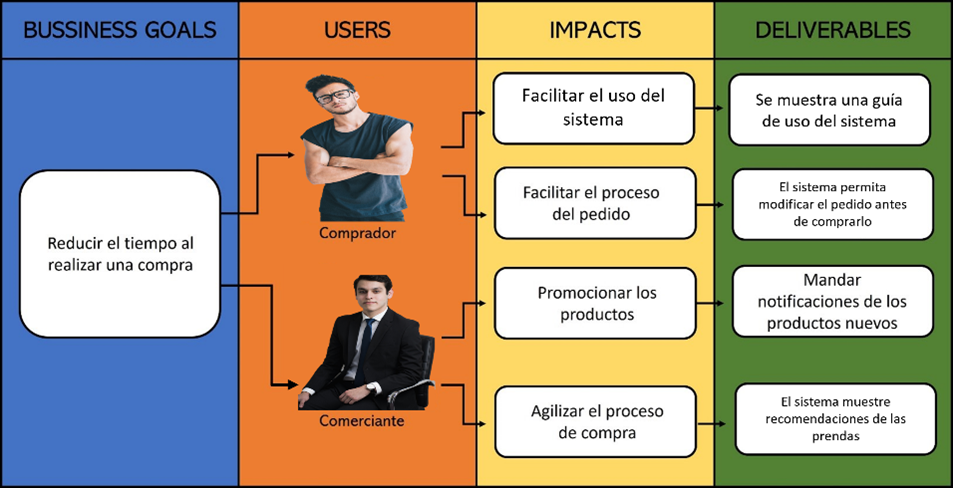

# Requirements Specification

## To-Be Scenario Mapping

Nos brinda una visión de la experiencia futura de usuario y es un gran artefacto para poner frente a frente a las a las partes interesadas. En el caso del usuario cliente notamos que un punto importante es el tener la capacidad de probarse por medio de su dispositivo móvil las prendas que sean de su agrado.

En el caso de las tiendas comerciales vemos que la capacidad de ofrecer el servicio adicional con el cual los clientes pueden probarse cualquier prenda representan un punto importante para resolver los problemas que se presentaban en el As-is Scenario Map.

## User Stories

A continuación, mostramos las historias de usuario que consideramos más importantes.

#### Epics

|Epic ID|Título|Descripción|Número de User Stories asociados|
|:----:|:----:|:----:|:----:|
|EP01|Almacenamiento de preferencias|Como cliente, quiero poseer una cuenta propia para guardar mis configuraciones.|2|
|EP02|Funcionalidades de probador|Como cliente, quiero contar con las funcionalidades de un probador de prendas para probarme ropa de manera virtual.|5|
|EP03|Asociación con tiendas|Como dueño de una tienda, quiero asociar mi negocio con el probador virtual para que mis clientes puedan acceder y comprar mis productos desde esta interfaz.|1|

#### User Stories

| User Story ID | Título | Descripción | Scenarios & Acceptance Criteria | Epic ID |
|:--:|:--:|:--:|:--|:--:|
|US01|Realidad aumentada para observar productos|Como cliente, quiero que mediante realidad aumentada pueda observar una representación de un producto, para poder conocerlo de mejor manera|SC01: Ingreso al probador y selecciono un producto para el uso de realidad aumentada    AC01   **Dado que** me encuentro en el apartado de realidad aumentada.   **Cuando** elija el producto a mostrar   **Y** le otorgue permiso al uso de realidad aumentada   **Entonces** la aplicación utilizará la cámara del equipo y mostrará el producto |EP02|
|US02|Creación de cuenta con el proveedor de la tienda|Como cliente, quiero poder crear una cuenta para guardar mis datos, preferencias y obtener mejores recomendaciones en el futuro|SC02: El cliente está en el probador e inicia la creación de su cuenta    AC02   **Dado que** me encuentro en el apartado de creación de cuenta   **Cuando** selecciono la opción para registrarme   **Y** asocio mi cuenta de la tienda en la que estoy   **Entonces** mi cuenta se creará   **Y** mis datos serán almacenados|EP02|
|US03|Lectura de código QR para inicio de sesión|Como cliente quiero leer el código QR que se encuentra en la pantalla del probador para obtener recomendaciones personalizadas a mis gustos|SC03: El cliente entra al probador y encuentra el código QR en la pantalla    AC03   **Dado que** encuentro el código QR en la pantalla   **Cuando** abra la aplicación de la tienda y escanee el código   **Entonces** el probador cargará mi perfil de recomendaciones e información personal   **Y** podré obtener recomendaciones personalizadas|EP02|
|US04|Generación de orden de compra|Como cliente quiero generar una orden de compra para poder pagar la prenda que he decido que me llevaré|SC04: El cliente tiene la prenda en el probador    AC04   **Dado que** tengo la prenda que me quiero llevar conmigo   **Cuando** seleccione comprar prenda   **Entonces** se me permitirá realizar el pago de la prenda en la caja o a través de un POS integrado    SC05: El cliente no tiene la prenda en el probador    AC05   **Dado que** no tengo la prenda que me quiero llevar conmigo   **Cuando** seleccione comprar prenda   **Entonces** se me permitirá ir a caja para recoger mi orden y realizar el pago respectivo|EP03|
|US05|Agregar productos a la lista de favoritos|Como cliente, quiero agregar productos a una lista de favoritos, para organizar mejor los productos que son de mi interés y mejorar las recomendaciones|SC06: El cliente agrega un producto a su lista de favoritos    AC06   **Dado que** estoy viendo un producto   **Cuando** selecciono la opción para agregarlo a mis favoritos   **Entonces** el sistema agregará el producto a mi lista de favoritos   **Y** mi algoritmo de recomendaciones mejorará|EP01|
|US06|Selección de diferentes modelos o colores de prenda|Como cliente, quiero personalizar el modelo o colores de la prenda que me probaré virtualmente para ampliar mis opciones de compra|SC07: El cliente personaliza el modelo de prenda    AC07   **Dado que** estoy viendo un producto con múltiples modelos   **Cuando** selecciono alguna otra opción de modelo   **Entonces** el sistema me mostrará la prenda virtualmente con realidad aumentada|EP01|
|US07|Búsqueda de un artículo|Como cliente, quiero buscar un producto en particular en una barra de búsqueda para obtener resultados de prendas de vestir que quiera probarme|SC08: El cliente escribe en la barra de búsqueda    AC08:   **Dado que** quiero encontrar un tipo de prenda específica   **Cuando** escriba en la barra de búsqueda con la pantalla táctil   **Y** aplique los filtros que necesite   **Entonces** el sistema me mostrará las prendas que coincidan|EP02|
|US08|Solicitud de asistencia a un trabajador|Como cliente, quiero que un trabajador de la tienda me traiga una prenda seleccionada para probármela físicamente|SC07: El cliente encontró una prenda que quiere probarse físicamente después de probársela virtualmente    AC09   **Dado que** encontré una prenda que quiero probarme físicamente   **Cuando** solicite que un encargado me traiga la prenda física al probador   **Entonces** se comunicará a un encargado para que recoja la prenda   **Y** podré recibir la prenda para probármela físicamente|EP02|

## Impact Mapping

En la presente sección se presenta el Impact Mapping de nuestro modelo de negocio digital, el cual fue elaborado con la herramienta UXPressia. Para su elaboración se realizó previamente las fichas para los User Persona de nuestros segmentos objetivos.

Como se puede observar en el artefacto se han incluido los Bussiness Goals. Asimismo, hemos incluido los Actors que en este caso serían nuestros User Personas analizados previamente. Por un lado, en la columna Impact hemos incluido los enunciados de cómo deseamos que los User Persona cambien o se comporten. También se responde a la pregunta “¿Qué tendría él/ella que hacer para ayudar a que se logre la meta?”. Por otro lado, en la columna Deliverables se incluye los elementos que respondan la pregunta “¿Qué puedo hacer como negocio digital para provocar esos Impacts?”. Por último, en la columna User Stories se incluye la descripción de los User Stories empleando el formato “**Como**... **quiero**... **para**...”, el cual permite obtener los features que nos ayudarán a producir los Deliverables identificados.

## Product Backlog

En esta sección se incluirán los User Stories con su respectiva estimación y priorización.

| # Orden | User Story ID | Título | Descripción | Story Points (1/2/3/5/8) |
| :-----: | :-----------: | :----: | :---------: | :----------------------: |
| 1 |US01|Realidad aumentada para observar productos|Como cliente, quiero que mediante realidad aumentada pueda observar una representación de un producto, para poder conocerlo de mejor manera| 8 |
| 2 |US06|Selección de diferentes modelos o colores de prenda|Como cliente, quiero personalizar el modelo o colores de la prenda que me probaré virtualmente para ampliar mis opciones de compra| 2 |
| 3 |US07|Búsqueda de un artículo|Como cliente, quiero buscar un producto en particular en una barra de búsqueda para obtener resultados de prendas de vestir que quiera probarme| 3 |
| 4 |US08|Solicitud de asistencia a un trabajador|Como cliente, quiero que un trabajador de la tienda me traiga una prenda seleccionada para probármela físicamente| 8 |
| 5 |US05|Agregar productos a la lista de favoritos|Como cliente, quiero agregar productos a una lista de favoritos, para organizar mejor los productos que son de mi interés y mejorar las recomendaciones| 1 |
| 6 |US04|Generación de orden de compra|Como cliente quiero generar una orden de compra para poder pagar la prenda que he decido que me llevaré| 5 |
| 7 |US02|Creación de cuenta con el proveedor de la tienda|Como cliente, quiero poder crear una cuenta para guardar mis datos, preferencias y obtener mejores recomendaciones en el futuro| 5 |
| 8 |US03|Lectura de código QR para inicio de sesión|Como cliente quiero leer el código QR que se encuentra en la pantalla del probador para obtener recomendaciones personalizadas a mis gustos| 3 |
