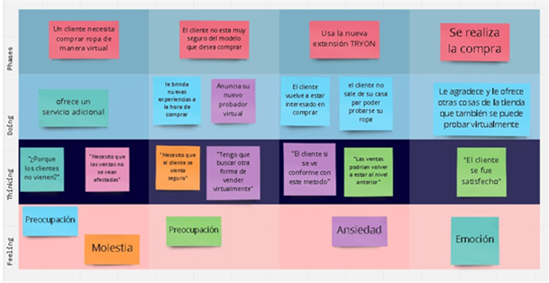

# Requirements Specification

## To-Be Scenario Mapping

Nos brinda una visión de la experiencia futura de usuario y es un gran artefacto para poner frente a frente a las a las partes interesadas. En el caso del usuario cliente notamos que un punto importante es el tener la capacidad de probarse por medio de su dispositivo móvil las prendas que sean de su agrado.

En el caso de las tiendas comerciales vemos que la capacidad de ofrecer el servicio adicional con el cual los clientes pueden probarse cualquier prenda representan un punto importante para resolver los problemas que se presentaban en el As-is Scenario Map.

## User Stories

A continuación, mostramos las historias de usuario que consideramos más importantes.

#### Epics

<table>
  <tr>
    <th>Epic ID</th>
    <th>Título</th>
    <th>Descripción</th>
    <th>Número de User Stories asociados</th>
  </tr>
  <tr>
    <td>EP01</td>
    <td>Gestión de cuenta</td>
    <td>Como cliente, quiero poseer una cuenta propia para guardar mis configuraciones y resultados preferidos.</td>
    <td>3</td>
  </tr>
  <tr>
    <td>EP02</td>
    <td>Funcionalidades de probador</td>
    <td>Como cliente, quiero contar con las funcionalidades de un probador de prendas para probarme ropa de manera virtual.</td>
    <td>6</td>
  </tr>
  <tr>
    <td>EP03</td>
    <td>Proceso de compra</td>
    <td>Como cliente, quiero realizar la compra de ropa en la aplicación para obtener la prenda que deseo.</td>
    <td>2</td>
  </tr>
</table>

#### User Stories

<table>
  <tr>
    <th>User Story ID</th>
    <th>Título</th>
    <th>Descripción</th>
    <th>Scenarios & Acceptance Criteria</th>
    <th>Epic ID</th>
  </tr>
  <tr>
    <td>US01</td>
    <td>Realidad aumentada para observar productos</td>
    <td>Como cliente, quiero que mediante realidad aumentada pueda observar una representación de un producto, para poder conocerlo de mejor manera</td>
    <td>SC01: Visualización de la prenda con AR   AC01: Permisos aceptados  <strong>Dado que</strong> me encuentro en la vista de probarse una prenda.   <strong>Cuando</strong> elija el producto a mostrar  <strong>Y</strong> acepte los permisos de usar la cámara del móvil  <strong>Entonces</strong> la aplicación utiliza la cámara del equipo y mostrará el producto con realidad aumentada sobre el cuerpo del cliente.
      AC02: Permisos denegados  
    <strong>Dado que</strong> me encuentro en la vista de probarse una prenda. 
    <strong>Cuando</strong> elija el producto a mostrar 
    <strong>Y</strong> no acepte los permisos de usar la cámara del móvil 
    <strong>Entonces</strong> la aplicación muestra un mensaje de advertencia 'Necesita otorgar permisos de cámara para esta funcionalidad'.</td>
    <td>EP02</td>
  </tr>
  <tr>
    <td>US02</td>
    <td>Creación de cuenta</td>
    <td>Como cliente, quiero poder crear una cuenta para guardar mis datos, preferencias y obtener mejores recomendaciones en el futuro</td>

  <td>SC02: El cliente realiza la creación de su cuenta    AC03: Creación de cuenta de manera exitosa   <strong>Dado que</strong> me encuentro en el apartado de creación de cuenta   <strong>Cuando</strong> completo los campos de nombre, correo y contraseña   <strong>Y</strong> selecciono el botón de crear cuenta   <strong>Entonces</strong> mi cuenta es creada   <strong>Y</strong> me redirige a la vista de inicio de sesión.
    AC04: Creación de cuenta fallida
<strong>Dado que</strong> me encuentro en el apartado de creación de cuenta 
<strong>Cuando</strong> completo los campos de manera incorrecta 
<strong>Y</strong> selecciono el botón de crear cuenta 
<strong>Entonces</strong> la aplicación me muestra una alerta indicando que los datos ingresados no son válidos.</td>
    <td>EP01</td>
  </tr>

  <tr>
    <td>US03</td>
    <td>Inicio de sesión</td>
    <td>Como cliente quiero iniciar sesión en mi cuenta para poder acceder a mis preferencias</td>

<td>SC03: El cliente inicia sesión    AC05: Inicio de sesión exitoso   <strong>Dado que</strong> me encuentro en la vista de inicio de sesión   <strong>Cuando</strong> ingreso mi email y contraseña   <strong>Y</strong> selecciono el botón de iniciar sesión   <strong>Entonces</strong> la aplicación me redirige hacia mi perfil    AC06: Inicio de sesión fallido   <strong>Dado que</strong> me encuentro en la vista de inicio de sesión   <strong>Cuando</strong> ingreso de manera incorrecta mi email y contraseña   <strong>Y</strong> selecciono el botón de iniciar sesión   <strong>Entonces</strong> se muestra una alerta indicando que mis datos son incorrectos </td>

  <td>EP01</td>
  </tr>

  <tr>
    <td>US04</td>
    <td>Agregar item al carrito de compras</td>
    <td>Como cliente quiero poder agregar una prenda al carrito de compras para poder continuar viendo otros items.</td>
<td>SC04: Cliente agrega producto a su carrito de compras  
AC07: Agregar item a carrito de compras de manera exitosa 
<strong>Dado que</strong> me encuentro en la vista de una prenda que me queda bien 
<strong>Y</strong> el ítem se encuentra disponible (en stock) 
<strong>Cuando</strong> selecciono el botón de Agregar a carrito de compras 
<strong>Entonces</strong> la prenda seleccionada es agregada al carrito 
<strong>Y</strong> la aplicación muestra un mensaje indicando que la prenda fue agregada exitosamente.  

AC08: Cliente no puede agregar item a carrito de compras 
<strong>Dado que</strong> me encuentro en la vista de una prenda que me queda bien 
<strong>Y</strong> el ítem no se encuentra disponible (sin stock) 
<strong>Cuando</strong> selecciono el botón de Agregar a carrito de compras 
<strong>Entonces</strong> la aplicación muestra un mensaje indicando que la prenda no está disponible.</td>

  <td>EP03</td>
  </tr>
  <tr>
    <td>US05</td>
    <td>Generación de orden de compra</td>
    <td>Como cliente quiero generar una orden de compra para poder pagar la prenda que he decido que me llevaré.</td>
<td>SC05: Cliente genera una orden de compra  
AC09: Generación de orden de compra de manera exitosa 
<strong>Dado que</strong> me encuentro en el carrito de compras 
<strong>Y</strong> tengo prendas en el carrito agregadas 
<strong>Cuando</strong> selecciono el botón de Generar orden de compra 
<strong>Entonces</strong> se genera la orden de compra con las prendas seleccionadas 
<strong>Y</strong> la aplicación me redirige a la pasarela para realizar el pago correspondiente.  

AC10: Cliente no puede generar una orden de compra 
<strong>Dado que</strong> me encuentro en el carrito de compras 
<strong>Y</strong> no tengo prendas en el carrito agregadas 
<strong>Cuando</strong> selecciono el botón de Generar orden de compra 
<strong>Entonces</strong> la aplicación me muestra un mensaje indicando que no se pudo generar la orden de compra.</td>

  <td>EP03</td>
  </tr>
  <tr>
    <td>US06</td>
    <td>Agregar productos a la lista de favoritos</td>
    <td>Como cliente, quiero agregar productos a una lista de favoritos, para organizar mejor los productos que son de mi interés y mejorar las recomendaciones</td>

<td>SC06: El cliente agrega un producto a su lista de favoritos  
AC11: Agregación de producto a favoritos 
<strong>Dado que</strong> estoy viendo un producto 
<strong>Cuando</strong> selecciono la opción para agregarlo a mis favoritos 
<strong>Entonces</strong> el sistema agrega el producto a mi lista de favoritos 
<strong>Y</strong> mi algoritmo de recomendaciones mejorará</td>

  <td>EP01</td>
  </tr>
  <tr>
    <td>US07</td>
    <td>Selección de diferentes modelos o colores de prenda</td>
    <td>Como cliente, quiero personalizar el modelo o colores de la prenda que me probaré virtualmente para ampliar mis opciones de compra.</td>
<td>SC07: El cliente personaliza el modelo de prenda  
AC12: Probarse variantes de un producto 
<strong>Dado que</strong> me estoy probando un producto con diversos colores de prenda y modelos 
<strong>Cuando</strong> selecciono alguna otra opción (por ejemplo, cambiar de polo rojo a verde) 
<strong>Entonces</strong> se carga un nuevo modelo de la prenda sobre la imagen del cliente</td>

  <td>EP02</td>
  </tr>

  <tr>
    <td>US08</td>
    <td>Búsqueda de un artículo mediante barra de búsqueda</td>
    <td>Como cliente, quiero buscar un producto en particular en una barra de búsqueda para obtener resultados de prendas de vestir que quiera probarme</td>

<td>SC08: El cliente usa la barra de búsqueda  
AC13: Escribe la prenda que desea en la barra 
<strong>Dado que</strong> quiero encontrar un tipo de prenda específica 
<strong>Cuando</strong> escriba en la barra de búsqueda el producto que busco 
<strong>Y</strong> aplique los filtros que necesite 
<strong>Entonces</strong> el sistema me muestra las prendas que coincidan con mi búsqueda  
AC14: Barra de búsqueda sin contenido 
<strong>Dado que</strong> quiero encontrar un tipo de prenda específica 
<strong>Cuando</strong> no escriba nada en la barra de búsqueda 
<strong>Y</strong> presione el botón de ‘Buscar’ 
<strong>Entonces</strong> la aplicación muestra un mensaje ‘Por favor, seleccione filtros o busque en la barra’</td>

  <td>EP02</td>
  </tr>

  <tr>
  <td>US09</td>
  <td>Búsqueda de artículos mediante filtros</td>
    <td>Como cliente, quiero buscar productos mediante filtros de búsqueda para obtener productos relacionados a mis preferencias selecciondas</td>

<td>SC09: El cliente selecciona filtros de búsqueda  
AC15: Todos los filtros seleccionados 
<strong>Dado que</strong> quiero encontrar prendas deportivas, de marca 'Adidas' 
<strong>Cuando</strong> seleccione los filtros de 'tipo de prenda: deportiva' y 'marca: Adidas' 
<strong>Y</strong> presione el botón de 'Buscar' 
<strong>Entonces</strong> la aplicación muestra resultados acorde a los filtros definidos  
AC16: Ningún filtro seleccionado 
<strong>Dado que</strong> quiero encontrar prendas deportivas, de marca 'Adidas' 
<strong>Cuando</strong> no seleccione los filtros relacionados a mi búsqueda 
<strong>Y</strong> presione el botón de 'Buscar' 
<strong>Entonces</strong> la aplicación muestra un mensaje 'Por favor, seleccione filtros o busque en la barra'  
AC17: Algunos filtros seleccionados 
<strong>Dado que</strong> quiero encontrar prendas deportivas, de marca 'Adidas' 
<strong>Cuando</strong> seleccione el filtro 'tipo de prenda: deportiva' 
<strong>Y</strong> presione el botón de 'Buscar' 
<strong>Entonces</strong> la aplicación muestra todos los resultados para prendas deportivas, mas no de la marca especificada.</td>

  <td>EP02</td>
  </tr>

  <tr>
  <td>US10</td>
  <td>Resultados de búsqueda</td>
    <td>Como cliente, quiero visualizar los artículos resultantes de mi búsqueda para conocer todas las opciones existentes en la tienda acordes a lo que busco. </td>

<td>SC10: El cliente visualiza los resultados de su búsqueda  
AC15: Hay resultados de búsqueda 
<strong>Dado que</strong> ingresé ‘polos Tommy Hilfiger hombre’ en la barra de búsqueda 
<strong>Cuando</strong> presione el botón de ‘Buscar’ 
<strong>Entonces</strong> la aplicación muestra una grilla con todos los polos Tommy Hilfiger para hombre existentes en el inventario de la tienda.  
AC16: No hay resultados de búsqueda 
<strong>Dado que</strong> ingresé ‘polos Tommy Hilfiger hombre color verde y amarillo’ en la barra de búsqueda 
<strong>Cuando</strong> presione el botón de ‘Buscar’ 
<strong>Y</strong> no haya resultados que coincidan con la búsqueda 
<strong>Entonces</strong> la aplicación muestra un mensaje ‘No hay resultados para su búsqueda’</td>

  <td>EP02</td>
  </tr>

  <tr>
  <td>US11</td>
  <td>Información detallada de producto</td>
    <td>Como cliente, quiero visualizar la información detallada de un producto seleccionado para saber su información a detalle como precio, marca, material, entre otros. </td>

<td>SC11: Visualización de detalle de artículo  
AC17: Información detallada del producto 
<strong>Dado que</strong> busqué ‘jeans Levis’ 
<strong>Cuando</strong> seleccione uno de los resultados 
<strong>Y</strong> haga ‘tap’ en dicho artículo 
<strong>Entonces</strong> la aplicación muestra una vista con la información detallada del producto.</td>

  <td>EP02</td>
  </tr>

</table>

## Impact Mapping

En la presente sección se presenta el Impact Mapping de nuestro modelo de negocio digital, el cual fue elaborado con la herramienta UXPressia. Para su elaboración se realizó previamente las fichas para los User Persona de nuestros segmentos objetivos.

Como se puede observar en el artefacto se han incluido los Bussiness Goals. Asimismo, hemos incluido los Actors que en este caso serían nuestros User Personas analizados previamente. Por un lado, en la columna Impact hemos incluido los enunciados de cómo deseamos que los User Persona cambien o se comporten. También se responde a la pregunta “¿Qué tendría él/ella que hacer para ayudar a que se logre la meta?”. Por otro lado, en la columna Deliverables se incluye los elementos que respondan la pregunta “¿Qué puedo hacer como negocio digital para provocar esos Impacts?”. Por último, en la columna User Stories se incluye la descripción de los User Stories empleando el formato “**Como**... **quiero**... **para**...”, el cual permite obtener los features que nos ayudarán a producir los Deliverables identificados.

## Product Backlog

En esta sección se incluirán los User Stories con su respectiva estimación y priorización.

<table>
  <tr>
    <th># Orden</th>
    <th>User Story ID</th>
    <th>Título</th>
    <th>Descripción</th>
    <th>Story Points (1/2/3/5/8)</th>
  </tr>
  <tr>
    <td>1</td>
    <td>US01</td>
    <td>Realidad aumentada para observar productos</td>
    <td>Como cliente, quiero que mediante realidad aumentada pueda observar una representación de un producto, para poder conocerlo de mejor manera</td>
    <td>8</td>
  </tr>
  <tr>
    <td>2</td>
    <td>US06</td>
    <td>Selección de diferentes modelos o colores de prenda</td>
    <td>Como cliente, quiero personalizar el modelo o colores de la prenda que me probaré virtualmente para ampliar mis opciones de compra</td>
    <td>2</td>
  </tr>
  <tr>
    <td>3</td>
    <td>US07</td>
    <td>Búsqueda de un artículo mediante barra de búsqueda</td>
    <td>Como cliente, quiero buscar un producto en particular en una barra de búsqueda para obtener resultados de prendas de vestir que quiera probarme</td>
    <td>3</td>
  </tr>
  <tr>
    <td>4</td>
    <td>US08</td>
    <td>Información detallada de producto</td>
    <td>Como cliente, quiero visualizar la información detallada de un producto seleccionado para saber su información a detalle como precio, marca, material, entre otros.</td>
    <td>8</td>
  </tr>
  <tr>
    <td>5</td>
    <td>US06</td>
    <td>Agregar productos a la lista de favoritos</td>
    <td>Como cliente, quiero agregar productos a una lista de favoritos, para organizar mejor los productos que son de mi interés y mejorar las recomendaciones</td>
    <td>1</td>
  </tr>
  <tr>
    <td>6</td>
    <td>US05</td>
    <td>Generación de orden de compra</td>
    <td>Como cliente quiero generar una orden de compra para poder pagar la prenda que he decidido que me llevaré</td>
    <td>5</td>
  </tr>
  <tr>
    <td>7</td>
    <td>US04</td>
    <td>Agregar item al carrito de compras</td>
    <td>Como cliente quiero poder agregar una prenda al carrito de compras para poder continuar viendo otros items.</td>
    <td>5</td>
  </tr>
  <tr>
    <td>8</td>
    <td>US02</td>
    <td>Creación de cuenta</td>
    <td>Como cliente, quiero poder crear una cuenta para guardar mis datos, preferencias y obtener mejores recomendaciones en el futuro</td>
    <td>3</td>
  </tr>
 <tr>
    <td>9</td>
    <td>US03</td>
    <td>Inicio de sesión</td>
    <td>Como cliente quiero iniciar sesión en mi cuenta para poder acceder a mis preferencias</td>
    <td>3</td>
  </tr>
</table>
