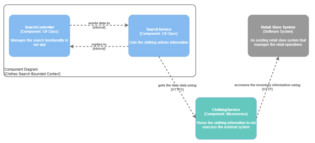
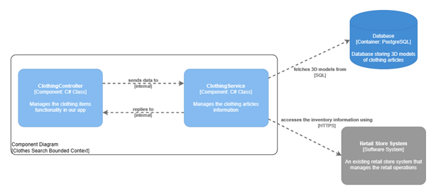

# Tactical-Level Software Design

En el presente capítulo, describiremos analizaremos a nivel táctico los *bounded contexts* identificados. Cabe recalcar que nos enfocaremos en los dos contextos de dominio identificados: Clothing Selection y Clothing Try On, debido a que los otros dos contextos son genéricos y buscamos centrarnos en los elementos directamente relacionados al modelo de negocio y valor agregado propuestos.

## Shared Domain Layer

Tomamos la decisión de proponer un diseño en el que la capa de dominio sea compartida entre los bounded contexts. Al tratarse de la manipulación de la información de prendas, creemos conveniente que ambos context la utilizan como parte principal de su funcionamiento y operación de acuerdo con el modelo de negocio. En ese sentido, la información de un artículo de vestir en particular está presente al obtenerlo como resultado de búsqueda y luego usarlo para que el usuario se lo pruebe de manera virtual. Por ello, nuestra capa de dominio está conformada por lo siguiente:

### Entities

- **ClothingArticle:** Almacenará la información importante de los value objects con la finalidad de no tener acceso a estos en otras clases. Asimismo, métodos importantes para la funcionalidad correcta, llámese getters y setters de los value objects.
- ClothingVariant: Las variantes que tienen las prendas.

### Value Objects

- **ClothingColor:** Clase que contiene los códigos RGB de los distintos colores de una misma prenda y las funciones necesarias para obtener esta información. De esa manera, el usuario observará en pantalla los colores disponibles de la prenda que se está probando. Con ello, el usuario podrá alternar rápidamente entre los distintos colores existentes.
- **ClothingPrice:**  Clase que contendrá el precio de la prenda con el símbolo de moneda correspondientes y las funciones necesarias para obtener esta información. De esa manera, el usuario observará en pantalla cuánto debe pagar por la prenda que se está probando.
- **ClothingSize:** Clase que contendrá las dimensiones (altura, ancho) de la prenda, los nombres que identificaran cada una de estas (M, S, L, XL) y las funciones necesarias para obtener esta información. De esa manera, el usuario observará en pantalla las tallas disponibles para la prenda que se está probando. Con ello, el usuario tendrá la posibilidad de seleccionar la talla de su preferencia.

### Abstracciones

- **ClothingRepository:** Interfaz que almacenará las funciones para obtener información de la base de datos de las prendas que se probará el usuario. Dentro de esta información se considerará el color, precio, nombre y demás.

## Bounded Context: Clothing Selection

Este bounded context llevará a cabo comandos de obtención de información acerca de las prendas de vestir en el inventario de la tienda en cuestión. Asimismo, esta sección llevará a cabo el detalle de las clases identificadas para este bounded context en un formato de diccionario. También se detallará el diagrama de componentes y de código que se usará en la arquitectura para el desarrollo táctico.

### Clothing Selection Interface Layer

**Nombre de la clase:** SearchController

**Categoría:** Controller

**Propósito:** Conectarse con los servicios de la tienda para obtener la información de la prenda que se busca, ya sea por criterios predeterminados como el tipo de ropa, marca, estilo de vestimenta, o si el usuario busca una prenda en particular mediante una barra de búsqueda incluida en nuestra aplicación

**Atributos:** SearchService

**Métodos:** Getters que accedan a la búsqueda en el sistema de la tienda y puedan retornar información de las prendas existentes.

### Clothing Selection Application Layer

**SearchService:** Ayuda a la gestión de búsqueda de prendas.

**SearchResultDTO:** Contiene las características principales de una prenda resultante de una búsqueda como: id, name, variants, price. Este luego pasará al bounded context de Clothing Try On para que la aplicación pueda gestionar el probarse la prenda bajo la información obtenida sobre la misma.

### Clothing Selection Infrastructure Layer

Esta capa es la encargada de comunicarse con los sistemas y servicios externos de la tienda (base de datos o su propia REST API) para obtener la información de la prenda para que, posteriormente, el probador virtual pueda hacer uso de ella y obtener los datos exactos. También, para contemplar que los criterios y resultados de la búsqueda de determinada prenda sean válidos en relación con lo esperado por nuestro modelo de negocio.

### Clothing Selection Software Architecture Component Level Diagrams

Para este diagrama de tercer nivel, damos un vistazo a profundidad sobre qué elementos componen nuestro bounded context de Clothing Search, aquí encontramos aquellos componentes que interactúan directamente para cumplir con las finalidades que esperamos en nuestra solución, particularmente para las reglas que rigen este contexto: búsqueda de artículos o prendas de vestir.

### Clothing Selection Software Architecture Code Level Diagrams

#### Clothing Selection Domain Layer Class Diagram

A continuación, mostramos el diagrama de clases representativo del presente *bounded context*, en el que evidenciamos la interacción entre los componentes descritos entre las diversas capas identificadas.

")

## Bounded Context: Clothing Try On

Este bounded context está relacionado a la lógica principal para llevar a cabo el probado de prendas de manera virtual. Por tanto, también accede a la información principal de los artículos (prendas) de la tienda, con el agregado que aquí procesará los modelos 3D para que se muestren sobre el cliente a través de la cámara de su dispositivo móvil.

### Clothing Try On Interface Layer

**Nombre de la clase:** ClothingController

**Categoría:** Controller

**Propósito:** Conectarse con los servicios de Fitster System y validar los datos de la prenda que se mostrará en pantalla.

**Atributos:** ClothingService

**Métodos:** Getters de los atributos importantes de las prendas disponibles en tienda.

### Clothing Try On Application Layer

**ClothingService:** Administra los datos obtenidos de las prendas del sistema del vendedor.

### Clothing Try On Infrastructure Layer

El presente *bounded context* contiene la implementación del repositorio de las prendas, el cual se encargará del correcto manejo de la persistencia de datos de las prendas disponibles en tienda. Los usuarios tendrán la oportunidad de realizar búsquedas personalizadas de las prendas que se acoplen a sus gustos y probarlas virtualmente. Asimismo, podrán alternar entre los colores disponibles y, después, añadirla rápidamente al “carrito de compras”.

### Clothing Try On Software Architecture Component Level Diagrams

Por otro lado, definimos también este diagrama de tercer nivel para este contexto, en el que damos un vistazo a profundidad sobre qué elementos lo componen. Encontramos la relación e interacción entre componentes sencillos que manipulan la información de una prenda de vestir, para que esta información pueda ser utilizada por los motores y nodos IoT y potenciar la imagen en realidad virtual que buscamos retratar mientras los clientes se prueban determinado artículo.

### Clothing Try On Software Architecture Code Level Diagrams

#### Clothing Try On Domain Layer Class Diagram

A continuación, mostramos el diagrama de clases representativo del presente *bounded context*, en el que evidenciamos la interacción entre los componentes descritos entre las diversas capas identificadas.

")

#### Domain Database Design Diagram

Como mencionamos inicialmente, nos centramos en los *bounded contexts* que son núcleo del negocio, y ambos están centrados en la lógica de búsqueda, selección, probarse virtualmente y compra de artículos de vestir de las tiendas asociadas. Por tanto, definimos el siguiente diagrama de base de datos que evidencia aquellas principales entidades ligadas al dominio y sus relaciones entre sí.

")
